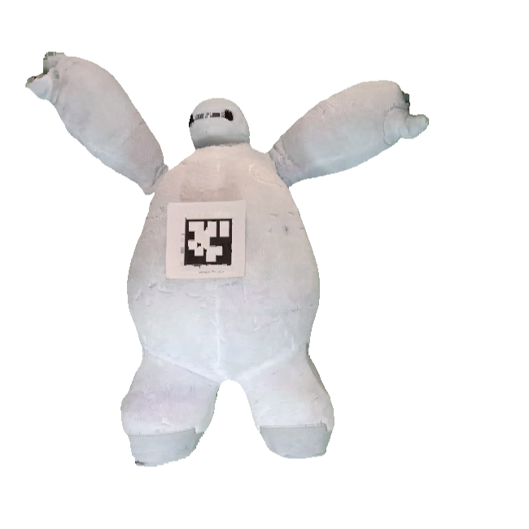

## Real-time Soft Body 3D Proprioception via Deep Vision-based Sensing

Ruoyu Wang, Shiheng Wang, Songyu Du, Erdong Xiao, Wenzhen Yuan, Chen Feng

### Abstract
Soft bodies made from flexible and deformable materials are popular in many robotics applications, but their proprioceptive sensing has been a long-standing challenge. In other words, there has hardly been a method to measure and model the high-dimensional 3D shapes of soft bodies with internal sensors. We propose a framework to measure the high-resolution 3D shapes of soft bodies in real-time with embedded cameras. The cameras capture visual patterns inside a soft body, and convolutional neural network (CNN) produces a latent code representing the deformation state, which can then be used to reconstruct the body’s 3D shape using another neural network. We test the framework on various soft bodies, such as a Baymax-shaped toy, a latex balloon, and some soft robot fingers, and achieve real-time computation (≤2.5 ms/frame) for robust shape estimation with high precision (≤1% relative error) and high resolution. We believe the method could be applied to soft robotics and human-robot interaction for proprioceptive shape sensing. Our code is available at: https://ai4ce.github.io/DeepSoRo/.
### Results

### Code
TBD

### Publication(s)
TBD
